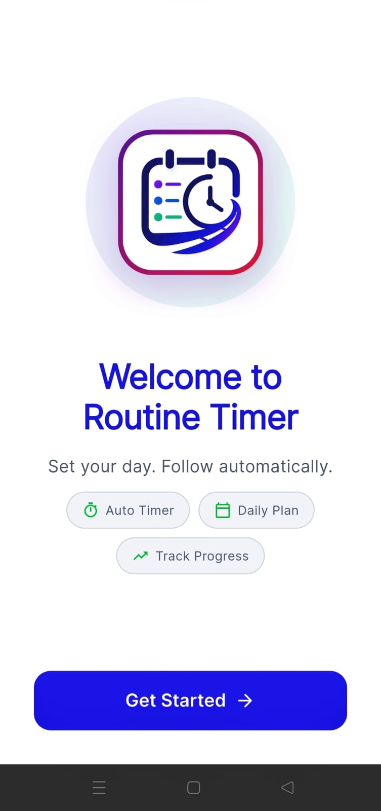
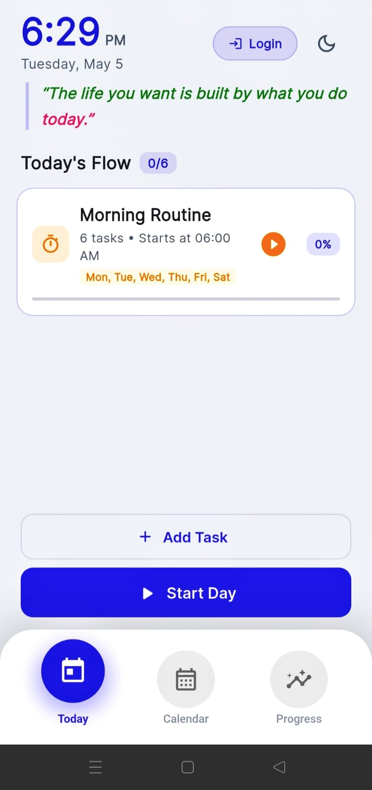
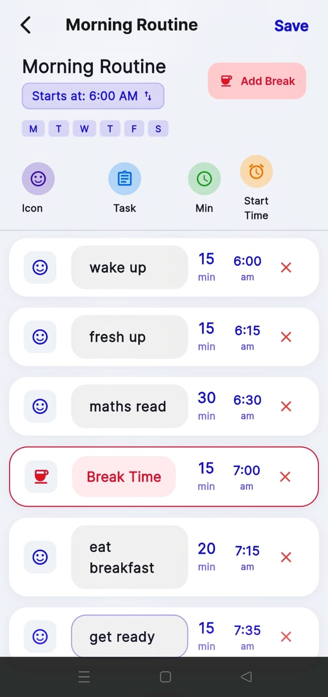
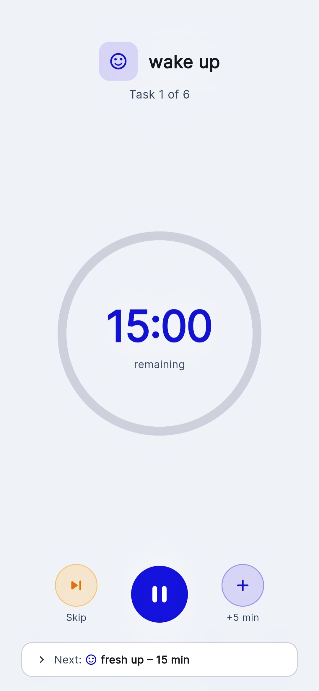

# ⏱️ Routine Timer – Build Better Daily Habits

Routine Timer is a simple and focused productivity app that helps you stay consistent with your daily routines.  
It guides you through tasks using structured timers, smart reminders, and clear progress tracking — so you actually follow what you plan.

---
## 📥 Download APK

<p align="center">
  <a href="https://github.com/selvakumar246/routine-timer-app/releases">
    
  </a>
</p>

## 📸 Screenshots

<p align="center">
  
  
  
  
</p>

## 🚀 Features

### ⚡ Multi-Task Routine Timer
- Create routines with multiple tasks  
- Automatic transitions between tasks  
- Clean, distraction-free timer experience  

### 🔔 Smart Notifications
- Gentle reminders before routines start  
- Timely alerts to keep users on track  
- Works reliably in the background  

### 🎯 Progress & Rewards
- Earn points for completing routines  
- Track daily consistency  
- Maintain simple streaks  

### 📅 Calendar Scheduling
- Plan routines for upcoming days  
- View and manage schedules easily  

### 👤 Multi-User Support
- Secure login with Firebase Authentication  
- User data is safely isolated  

---

## 🛠️ Tech Stack

- **Flutter (Dart)** – UI & core logic  
- **Firebase** – Authentication & cloud sync  
- **SQLite (sqflite)** – Local storage  
- **Kotlin (Android)** – Native integrations  
- **Provider** – State management  

---

## 🏗️ Project Structure

```bash
lib/
├── app/  Reusable components 
├── data/ Models & database
├── providers/ Logic & state
├── screens/ UI screens
├── widgets/ Reusable components

android/
└── native (Kotlin)


```

## ⚙️ How It Works

1. Create your daily routine  
2. Start the timer and follow each task  
3. Get reminders to stay consistent  
4. Track your progress  
5. Build better habits over time  

---

## 📱 Screens

- Home Dashboard  
- Active Timer  
- Progress / Profile  
- Onboarding  

---

## 🔐 Data & Privacy

- User-based data separation  
- Secure authentication with Firebase  
- Local storage for fast performance  

---

## 🎯 Goal

Routine Timer focuses on one thing:

> Helping you stay consistent with your daily habits.

No unnecessary features. Just execution.

---

## 📌 Status

- 🚧 Actively improving  
- 📈 Focused on performance and usability  

---

## 🤝 Contributing

Suggestions and improvements are always welcome.

---

## 📬 Contact

📧 [vjselvakumarofficial@gmail.com](mailto:vjselvakumarofficial@gmail.com)
